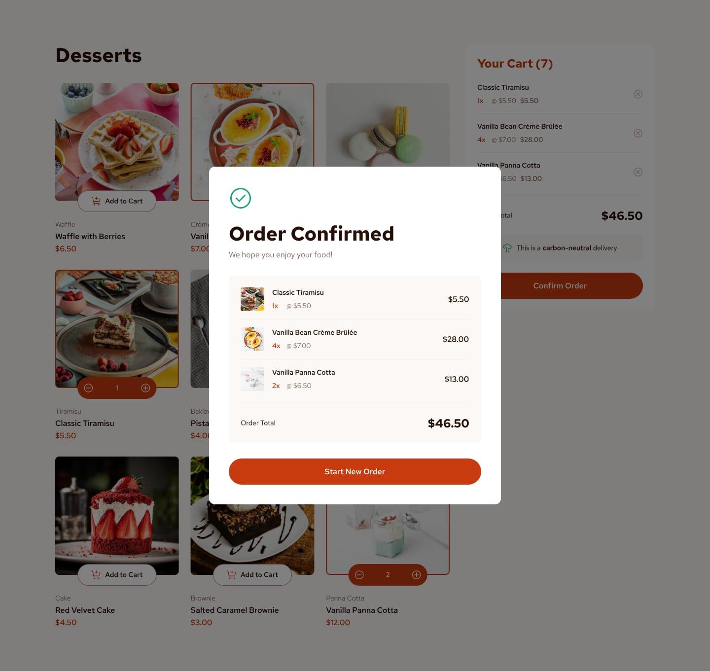
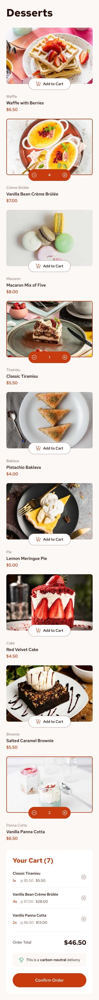

# Frontend Mentor - Product list with cart

This is a solution to the [Product list with cart challenge on Frontend Mentor](https://www.frontendmentor.io/challenges/product-list-with-cart-5MmqLVAp_d/hub).

## Table of contents
- [Screenshot](#screenshot)
- [Links](#links)
- [Built with](#built-with)

## Screenshot

**Desktop**

**Mobile**

## Links

- Live Site URL: [https://mo7aziz.github.io/product-list-with-cart/](https://mo7aziz.github.io/product-list-with-cart/)

## Built with

-HTML
-CSS
-Js
